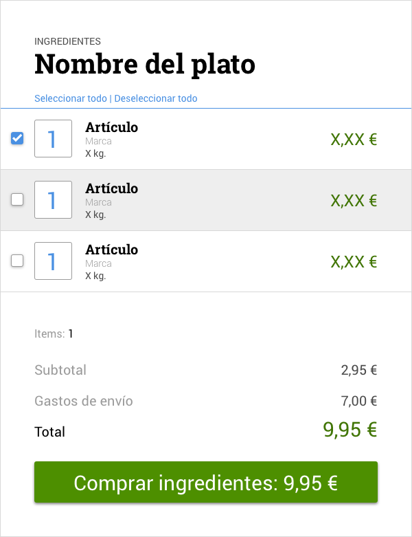

# Prueba técnica #5

Con los datos que nos facilita este [JSON](https://raw.githubusercontent.com/Adalab/recipes-data/master/rissoto-setas.json) de la receta del rissoto de setas, se hará un pequeño frontal con el nombre del plato, y la lista para comprar los ingredientes teniendo en cuenta que:
- Podrá seleccionarse todos los ingredientes, alguno o ninguno
- Se podrá cambiar la cantidad de un artículo
- Siempre se tendrá una lista actualizada de lo que costaría hacer un pedido (en caso de tener elementos seleccionados)
- El botón de compra siempre marcará dicha cantida
- El botón de compra debería llevar a la url final de compra, pero eso lo dejaremos para otro día
- Uso de Bootstrap

## Guía gráfica
Esta imagen es una guía para hacernos una idea de cómo debería quedar:

 

 ## Sobre la autora:

 Puedes espiarme en:

 
 
 

## Recursos
- https://wesbos.com/template-strings-html/
- http://www.etnassoft.com/2016/10/05/template-strings-en-es6-estudiando-las-nuevas-plantillas-de-cadena-en-javascript/
- https://desarrolloweb.com/articulos/2291.php
- https://stackoverflow.com/questions/4148499/how-to-style-a-checkbox-using-css
